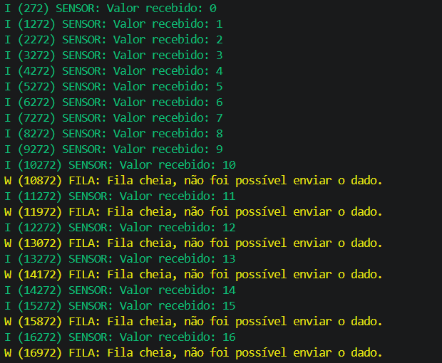

# Desafio 1: Comunicação entre Tarefas com FreeRTOS e ESP32

Este projeto demonstra a implementação de um sistema produtor-consumidor utilizando o RTOS **FreeRTOS** no microcontrolador ESP32. O objetivo é explorar a comunicação entre tarefas distintas através de filas (**Queues**) e observar o comportamento do escalonador sob diferentes condições de temporização.

---

## Enunciado do Desafio

Implemente um pequeno sistema com duas tarefas utilizando FreeRTOS:
1. **Task de Leitura (Produtor):** Gerar um valor (contador) a cada 500 ms.
2. **Task de Envio Serial (Consumidor):** Imprimir os dados no terminal utilizando logs.
3. **Comunicação:** Utilizar uma `Queue` do FreeRTOS para comunicar as duas tarefas.

---

## Resultados Observados
Conforme demonstrado na imagem dos logs, o sistema apresenta um comportamento de transbordamento de fila (overflow).

## Análise Crítica:
Saturação: Como a tarefa de leitura é 2x mais rápida (500ms) que a de escrita (1000ms), a fila de 10 posições atinge sua capacidade máxima rapidamente.

Perda de Dados: O log exibe o aviso W (FILA): Fila cheia, indicando que a tarefa produtora descartou informações porque o consumidor não liberou espaço a tempo.

## Reflexões Técnicas
##### 1. O que acontece se a fila ficar cheia?

A tarefa que tenta enviar o dado (xQueueSend) entrará em estado de Bloqueio (Blocked) pelo tempo máximo especificado. Se nenhum espaço for liberado nesse intervalo, a função retorna um erro (como errQUEUE_FULL) e o dado é perdido.

##### 2. Qual deve ser o tamanho ideal da queue?

Depende da dinâmica do sistema. Se as tarefas têm velocidades similares com pequenas variações (jitter), uma fila pequena (5-10 posições) é suficiente. Se houver "rajadas" de dados em alta velocidade, a fila deve ser dimensionada para suportar o maior pico de dados esperado sem estourar a memória RAM (Heap).

##### 3. O que acontece se a task de envio for mais lenta que a de leitura?

Ocorrerá um engarrafamento de dados. A fila ficará permanentemente cheia, a latência entre a leitura do sensor e a exibição aumentará, e haverá perda sistemática de informações (overflow), comprometendo a fidelidade do monitoramento em tempo real.

