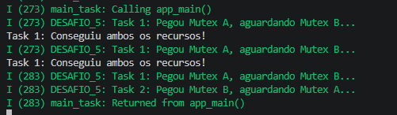
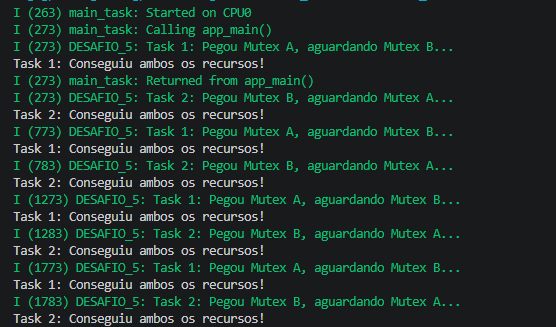

# Desafio 5: O Problema do Deadlock

Este projeto demonstra o conceito de **Deadlock** (Impasse), uma falha lógica onde duas ou mais tarefas ficam impedidas de prosseguir porque cada uma aguarda por um recurso que está em posse da outra.

## O Cenário do Problema

O sistema trava devido à **espera circular**:
1. A **Task 1** obtém o `mutexA`.
2. O escalonador alterna para a **Task 2**, que obtém o `mutexB`.
3. A **Task 1** tenta pegar o `mutexB` (está com a Task 2) e entra em estado de bloqueio.
4. A **Task 2** tenta pegar o `mutexA` (está com a Task 1) e também bloqueia.
5. **Resultado:** Nenhuma das duas tarefas libera o que já tem, e o sistema para.

---

## Visualização do Fluxo

### Sistema em Deadlock (Travado)

  

### Sistema Corrigido (Funcionando)

  

---

##  Respostas do Desafio

### 1. O que acontece com o sistema após algum tempo?
O sistema **trava**. As tarefas param de imprimir mensagens no console e ficam presas indefinidamente no estado *Blocked*.

### 2. Por que o sistema trava?
O sistema trava devido à inversão na ordem de aquisição de recursos. A Task 1 retém o Mutex A e solicita o B, enquanto a Task 2 retém o Mutex B e solicita o A. 

### 3. Como evitar esse problema?
Existem várias estratégias:
* **Delays Estratégicos:** Usar delays pode reduzir a chance de colisão.
* **Hierarquia de Recursos:** Definir uma ordem fixa para pegar os mutexes (ex: ambas as tarefas devem sempre pegar o Mutex A antes do B).
* **Timeouts:** Em vez de `portMAX_DELAY`, usar um tempo limite. Se não conseguir o segundo mutex, a tarefa libera o primeiro e tenta novamente mais tarde.

