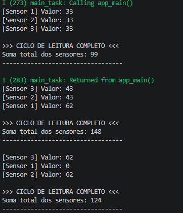

# Desafio 6: Sincronização com Event Groups

Este projeto explora o uso de **Event Groups** para gerenciar a sincronização de múltiplas tarefas produtoras (sensores) e uma tarefa consumidora (processamento). 

## Objetivo
Demonstrar como a função `xEventGroupWaitBits` pode ser configurada para agir como uma barreira lógica, permitindo que o processamento só ocorra quando um conjunto específico de condições (bits) for satisfeito.

---

## Respostas para Reflexão

  

### 1. Como garantir que os valores lidos correspondem ao ciclo correto?
No código atual, usamos variáveis globais simples. Em sistemas onde o tempo de processamento varia muito, isso pode causar "atropelamento" de dados. Para garantir integridade total:
* **Queues:** Em vez de variáveis globais, cada sensor enviaria seu dado para uma fila específica. A task de processamento leria as filas somente após o Event Group liberar.
* **Structs Protegidas:** Usar um Mutex para proteger uma estrutura que contém os dados e um "timestamp" ou número de sequência.

### 2. Como escalonar mais sensores ou tipos de dados diferentes?
* **Expansão de Bits:** Um Event Group no ESP32 suporta até 24 bits (eventos). Podemos adicionar mais sensores apenas definindo `BIT_4`, `BIT_5`, etc.
* **Uso de Structs:** Se os sensores enviarem tipos de dados diferentes (float, int, arrays), a melhor forma de escalonar é usar uma **Fila de Structs** (ou Fila de Ponteiros) onde cada mensagem identifica qual sensor enviou o quê.
* **Multi-Eventos:** Criar múltiplos grupos de eventos para diferentes subsistemas (ex: Grupo de Energia, Grupo de Navegação, Grupo de Payload).

---

##  Tecnologias Utilizadas
* **ESP-IDF v5.x**
* **FreeRTOS Event Groups**: Sincronização baseada em lógica AND/OR.
* **Task Prioritization**: Task de processamento com maior prioridade para esvaziar a barreira assim que os dados chegam.