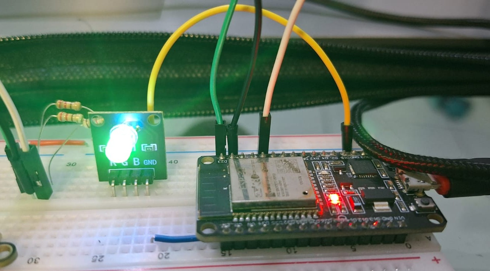
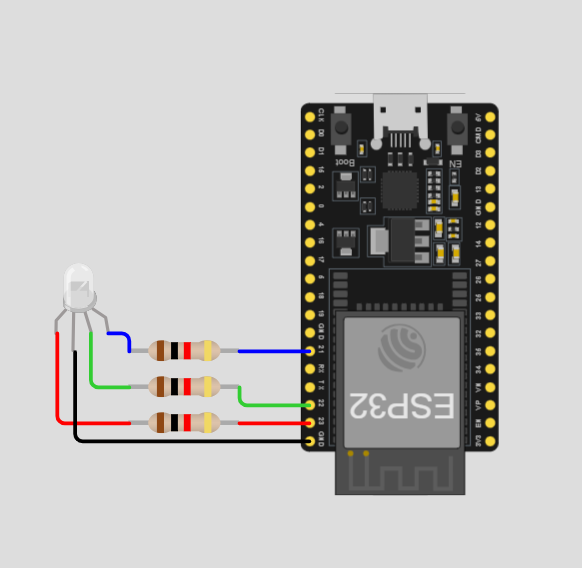
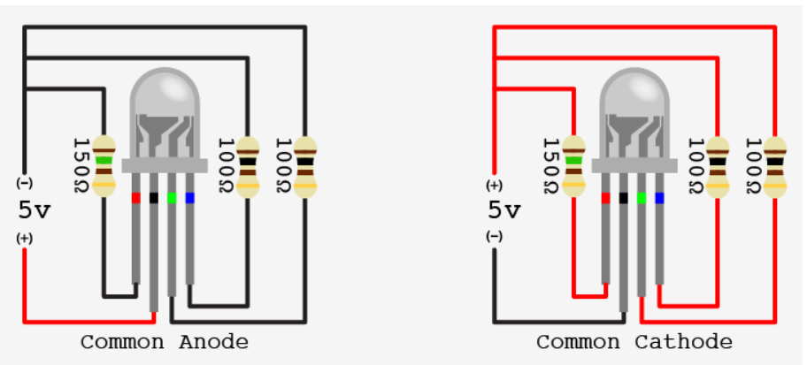

# Componente LED RGB para ESP32 (PWM/LEDC)

Este componente foi desenvolvido para facilitar o controle de LEDs RGB no ESP32 utilizando o periférico de hardware **LEDC (LED Control)**. Ele suporta o ajuste de cores através de Duty Cycle (PWM) e possui proteção nativa para ambientes **RTOS**.

<div align="center">
  
</div>

## Montagem do Hardware
Para garantir o funcionamento correto do componente, a montagem física deve seguir o mapeamento de pinos definido no firmware. Abaixo, a representação do circuito utilizando resistores limitadores de corrente para proteger as saídas do ESP32.

<div align="center">
  
  <p><i>Montagem do circuito no Wokwi.</i></p>
</div>

A imagem abaixo ilustra a conexão dos pinos Red, Green e Blue aos GPIOs correspondentes (23, 22 e 21), compartilhando um barramento comum.

## Tipos de LED RGB: Ânodo Comum vs. Cátodo Comum
Ao realizar a montagem, é crucial identificar se o seu LED é de Ânodo Comum ou Cátodo Comum, pois isso altera a conexão do pino mais longo (comum) e a lógica de acionamento:

<div align="center">
  
  <p><i>Esquemático de funcionamento interno e pinagem do LED RGB.</i></p>
</div>

**Fonte:** [DIoT Labs - RGB LEDs](https://diotlabs.daraghbyrne.me/docs/leds-continued/rgb-leds/)

Ânodo Comum (Common Anode): O pino comum deve ser conectado ao VCC (3.3V). Neste caso, o LED acende quando a saída do ESP32 está em nível LOW (ou duty cycle baixo).

Cátodo Comum (Common Cathode): O pino comum deve ser conectado ao GND. O LED acende quando a saída está em nível HIGH (duty cycle alto).

## Funcionalidades

- **Controle PWM de Hardware:** Utiliza o periférico LEDC para controle suave e eficiente.
- **Thread-Safe:** Implementação protegida por **Mutex**, permitindo que múltiplas tarefas alterem a cor do LED sem corromper as configurações dos canais.
- **Validação de Parâmetros:** Checagem rigorosa de GPIOs, canais e resolução de timer para evitar falhas de hardware.
- **Documentação Doxygen:** Código totalmente comentado para geração automática de documentação.

---

## Como Usar

### 1. Configuração e Inicialização
Defina os pinos e canais que deseja utilizar na estrutura de configuração:

```c
led_rgb_config_t led_config = {
    .red_pin = RED_PIN_GPIO,
    .blue_pin = BLUE_PIN_GPIO,
    .green_pin = GREEN_PIN_GPIO,

    .red_channel = RED_LEDC_CHANNEL,
    .green_channel = GREEN_LEDC_CHANNEL,
    .blue_channel = BLUE_LEDC_CHANNEL,

    .timer_num = LEDC_TIMER,
    .duty_resolution = LEDC_DUTY_RESOLUTION,
};

led_rgb_handle_t led_handle;
led_rgb_init(&led_handle, &led_config);
```

### 2. Alterando Cores
O comando set_color aceita valores baseados na resolução escolhida (ex: 0 a 255 para 8 bits).

```c
// Define cor Branca (Brilho máximo em todos os canais)
led_rgb_set_color(&led_handle, 255, 255, 255);

// Desliga o LED
led_rgb_set_color(&led_handle, 0, 0, 0);
```
